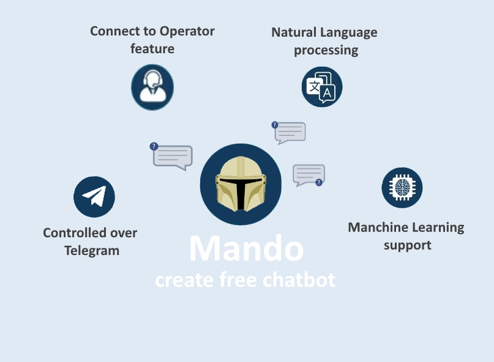

# Mando - create free chatbot

 

This is free chatbot builder platform powered by SpringBoot and ApacheOpenNLP libs

Use Mando chatbot to create and menage your own chatbot using Telegram

Just try yourself here -> <a href="https://t.me/create_free_chatbot">Open Telegram Bot Mando</a>

## Quick Start

**Prerequisites**

Please be sure that the following components are installed on your computer before running locally:

- JDK 11
- Gradlew
- MongoDb

**Custom properties**

You also you need to set the following properties 

~~~~
# telegram
TELEGRAM_BOT_NAME=yourBotName
TELEGRAM_BOT_KEY=yourBotApiKey
TELEGRAM_BOT_OWNER_USERID=yourTelegramChatId
# db
MONGO_URL=mongodb://localhost:27017/yourDataBaseName
~~~~

## Current issues

- no unit test coverage
- overcomplicated Telegram workflow

## Deploy with dokku in DigitalOcean

###initial setup
1. Create dokku repo  
   `dokku git:allow-host github.com`
1. Create personal access token in GitHub account
1. Add that toke to dokku  
   `dokku git:auth github.com ?username? ?personal-access-token?`

###deploy steps
1. Push the latest changes to GitHub
1. Login to DigitalOcean and use console
1. Stop app to free up memory for a build, otherwise deploy will fail as container  
   `dokku ps:stop bot`
1. `dokku git:sync --build bot https://github.com/mykovolod/mando-chatbot.git`
1. Check logs
   `dokku logs bot -t`
